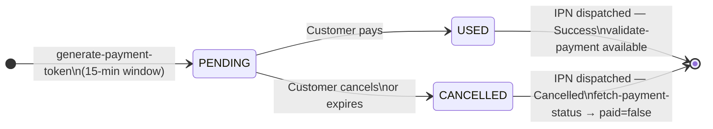

# Overview

The ZiCharge Merchant Payment Gateway lets your platform accept payments from any ZiCharge wallet account. From the customer's perspective it is a one-page checkout — mobile number and PIN. From your platform's perspective it is a small set of HTTP endpoints plus an asynchronous IPN callback.

---

## Supported flows

<div class="zi-cards" markdown>

<div class="zi-card zi-card--flow" markdown>
:material-web: **Hosted Payment Page**

Mint a token → redirect customer to the gateway's hosted page → receive IPN + validate server-side.

<span class="zi-badge">Best for: web checkouts · mobile webviews · QR-to-link</span>
</div>

<div class="zi-card zi-card--flow" markdown>
:material-api: **Direct Charge**

Mint a token → submit customer credentials directly to `POST /merchant/payment/direct` from your trusted backend.

<span class="zi-badge">Best for: custom checkout surfaces with PCI-equivalent controls</span>
</div>

<div class="zi-card zi-card--flow" markdown>
:material-qrcode: **QR Token**

Same as hosted page, but the response also includes a server-generated QR image URL and `expires_in_minutes`.

<span class="zi-badge">Best for: in-store POS · kiosks · printed media</span>
</div>

<div class="zi-card zi-card--flow" markdown>
:material-cash-refund: **Cash-Back**

Push a refund or promotional credit from your merchant wallet to a customer wallet. Settled synchronously.

<span class="zi-badge">Best for: refunds · loyalty rewards · promotional credits</span>
</div>

</div>

!!! info ""
    All four flows share the **same authentication model** and the **same IPN contract**.

---

## Environments

<div class="zi-env-grid" markdown>

<div class="zi-env-card zi-env-card--sandbox" markdown>
### Sandbox
`https://dev.zicharge.com`

Integration testing environment. No real funds move. Shares the exact same wire contract as production.

- Test wallets provisioned on request
- Data is persistent but not warranted
- Do not load-test this environment
</div>

<div class="zi-env-card zi-env-card--prod" markdown>
### Production
`https://secure.zicharge.com`

Live transaction environment. TLS 1.2+ enforced. No HTTP fallback.

- Real funds movement
- 99.9% monthly uptime SLA
- Zero-downtime deployments
</div>

</div>

---

## API endpoints

All API calls are `POST` requests to the base URL. The standard endpoint paths are:

```
POST https://secure.zicharge.com/merchant/generate-payment-token
POST https://secure.zicharge.com/merchant/payment/validation
POST https://secure.zicharge.com/merchant/fetch-payment-status
```

---

## Response envelope

Every endpoint returns **HTTP 200** — including on business-level failures. The logical outcome is always in the `code` field of the response body:

```json
{
  "code": 200,
  "messages": ["Successfully Deposited."],
  "data": {
    "transaction_id": 123456,
    "order_id": "ORD-2026-000123",
    "status": "Success"
  }
}
```

| Field | Type | Meaning |
|-------|------|---------|
| `code` | `integer` | Logical outcome. `200` = success. See [Error Codes](06-error-codes.md) for all values. |
| `messages` | `string[]` | Human-readable messages. Always an array. Localized per `Accept-Language`. |
| `data` | `object \| null` | Endpoint-specific payload. `null` on errors. |

!!! info "Why always HTTP 200?"
    Always returning HTTP 200 at the transport layer prevents auto-retry behaviour in proxies and SDKs that treat non-2xx as a transport failure — which can cause duplicate charges. The body `code` field gives your client full control over retry semantics.

### Content types

Both `application/json` and `application/x-www-form-urlencoded` are supported. JSON is recommended.

| Endpoint family | JSON | Form-encoded |
|-----------------|:----:|:------------:|
| Generate token | Required | Required |
| Validate / status / token-data | Required | Required |
| Direct payment | Required | Required |
| Cash-back | Required | Required |
| Transactions list | Yes (GET) | — |
| IPN **to your listener** | — | Yes — we POST form-encoded to you |

---

## Key identifiers

| Identifier | Format | Source | Purpose |
|------------|--------|--------|---------|
| `merchant_mobile_no` | `+964XXXXXXXXXX` | Provisioned at onboarding | Identifies your wallet on every server-to-server call |
| `store_password` | Opaque string | Provisioned at onboarding | Authenticates server-to-server calls — **never expose client-side** |
| `order_id` | Unique string | **Your system** | Idempotency anchor — same `order_id` will not double-charge |
| `payment_token` | Opaque, ≥ 32 chars | Returned by `generate-payment-token` | Bound to one `order_id`, valid for 15 minutes |
| `transaction_id` | Numeric, server-issued | Returned in IPN + validation | **Canonical ZiCharge reference — use this in your books** |
| `customer_mobile_no` | `+964XXXXXXXXXX` | Set by customer at checkout | The paying wallet account |

---

## Token lifecycle

A token is **valid for 15 minutes** from creation. After expiry it cannot be paid. If a customer opens an already-expired token, the gateway marks it cancelled and fires a `Cancelled` IPN.



---

## Amounts & currency

<div class="zi-info-row" markdown>

<div class="zi-info-box" markdown>
**Currency**

All amounts are in **IQD** (Iraqi Dinar). There is no multi-currency support.
</div>

<div class="zi-info-box" markdown>
**Minimum**

`bill_amount` must be at least **250 IQD**. Sub-minimum tokens are rejected at mint, not at payment time.
</div>

<div class="zi-info-box" markdown>
**Precision**

Amounts are validated with `BigDecimal` precision on the server. There is no floating-point rounding anywhere in the payment path.
</div>

</div>

---

## Localization

Pass `Accept-Language` on any request. A `lang` body field overrides the header when both are present.

| Value | Language |
|-------|----------|
| `en` | English |
| `ar` | Arabic |
| `ku` | Kurdish (Sorani) |

Error messages, success messages, and the hosted payment page are all localized.

---

## Where to go next

<div class="zi-cards" markdown>

<div class="zi-card" markdown>
:material-swap-horizontal: **Payment Flow**

End-to-end sequence diagrams, state machine, IPN retry policy, and timing budgets.

[Read payment flow →](03-payment-flow.md)
</div>

<div class="zi-card" markdown>
:material-api: **API Reference**

Every endpoint with full request/response schemas and examples.

[Read API reference →](04-api-reference.md)
</div>

<div class="zi-card" markdown>
:material-information-outline: **Platform Notes**

API behaviour specifications, validation rules, and operational characteristics.

[Read platform notes →](08-migration-notes.md)
</div>

<div class="zi-card" markdown>
:material-test-tube: **Testing & Go-Live**

Sandbox test checklist and production go-live checklist.

[Read testing guide →](07-testing-and-go-live.md)
</div>

</div>
