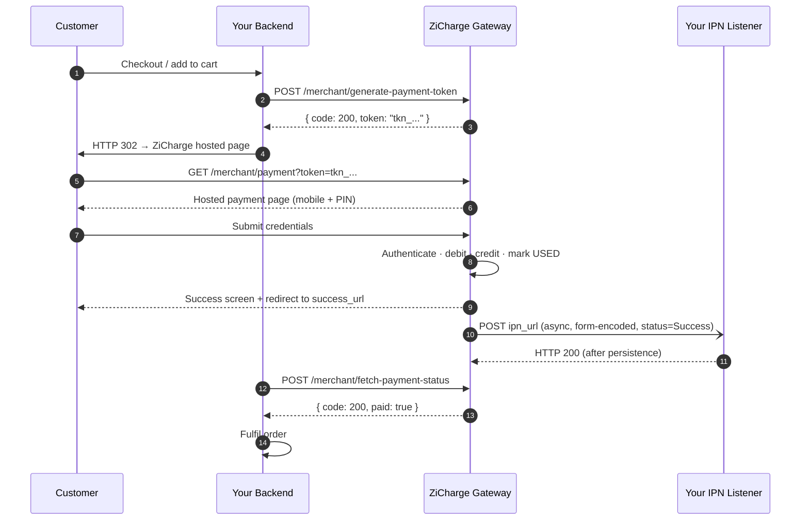
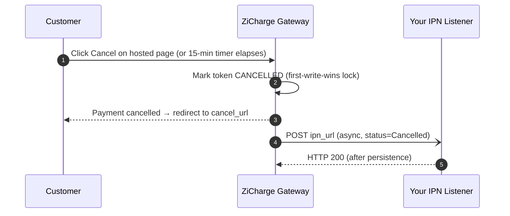
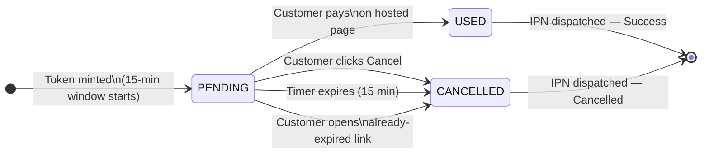
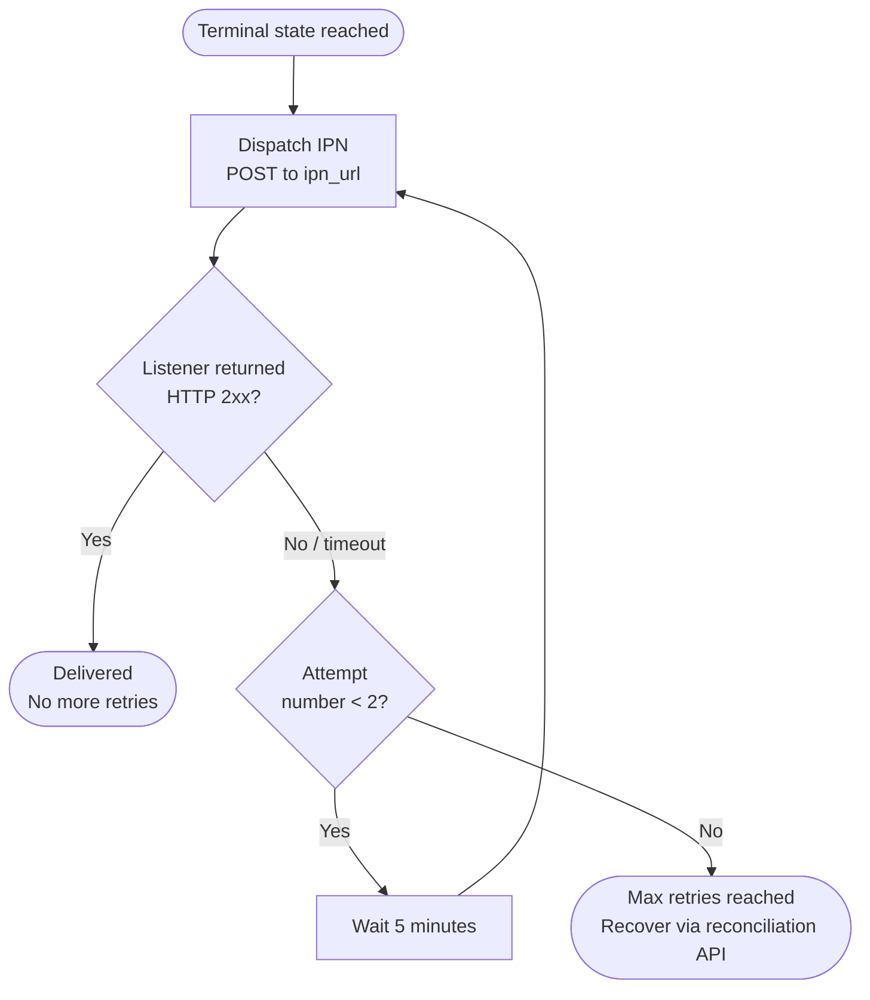
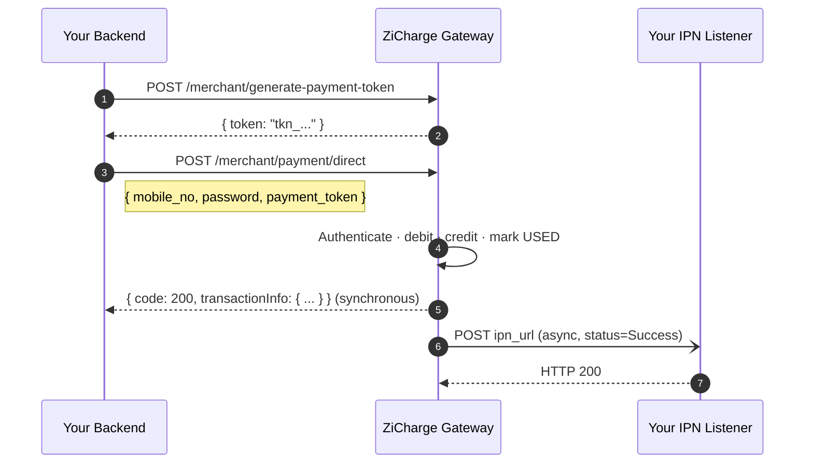

# Payment Flow

Read this before the API reference — the endpoints will make much more sense as a glossary once you understand the flow end-to-end.

**Token window**

15 minutes from mint. After expiry, the token cannot be paid and will auto-cancel on next open.

**IPN retries**

Up to 2 attempts. If the first attempt fails, a retry is sent after 5 minutes.

**Confirmation**

Use both the IPN and a synchronous status check before fulfilling — they are both authoritative.

---

## Happy path — hosted page

!!! info "Two confirmation channels — both intentional"
    The **IPN callback** is your primary signal. The synchronous **`fetch-payment-status`** call is your fallback when the IPN is delayed or your listener was briefly down. Either one is authoritative on its own — using both makes your integration bulletproof.

---

## Customer cancels or token expires

!!! warning "Release the cart on a Cancelled IPN"
    When you receive `status=Cancelled`, release the hold on the customer's cart immediately. If your listener was down during the retry window, poll `fetch-payment-status` after your order timeout to recover.

---

## Token state machine

State transitions are protected by three mechanisms:

1

**Pessimistic write lock**

Token row is locked during payment processing with a 3 s wait timeout — fail-fast under contention.

2

**Conditional UPDATE**

Cancel runs `WHERE cancelled_at IS NULL` — first-write-wins, no silent overwrites.

3

**Atomic dispatch claim**

IPN sends are claimed atomically before dispatch — duplicate IPNs across overlapping retry runs are physically impossible.

---

## IPN delivery & retry policy

| Attempt | Timing |
|---------|--------|
| 1 | Immediately after database commit |
| 2 | Retry sent 5 minutes after the first failed attempt |
| Max | 2 attempts per terminal event |

!!! danger "Acknowledge only after you persist"
    Return HTTP **2xx only after** writing the IPN to your database. A 2xx permanently stops all retries. If your database is unavailable, return **5xx** and we will retry.

---

## Direct payment flow

For merchants running their own checkout surface — mobile app or in-store POS:

!!! warning "PCI-equivalent controls required"
    The direct endpoint accepts the customer's wallet password. Your channel **must** be server-to-server only — never route customer credentials through a browser or mobile client, and never persist the password. Prefer the hosted page for any web or webview context.

---

## Reconciliation

Use these read-only endpoints when the IPN is late, your listener was down, or you need to confirm before fulfilling:

### fetch-payment-status
`POST /merchant/fetch-payment-status`

Fast yes/no check. Exact-match on `(merchant_id, order_id, amount)` at the database level.

**Use when:** you know the `order_id` and `amount` and need a quick paid/unpaid answer.

### validate-payment
`POST /merchant/validate-payment`

Full transaction detail — `transaction_id`, `customer_account_no`, `received_at`, and `status`.

**Use when:** you need the canonical ZiCharge reference for your books or a support query.

Both endpoints are read-only and safe to call as often as needed.

---

## Timing reference

| Operation | Typical | P99 budget |
|-----------|:-------:|:----------:|
| `generate-payment-token` | < 100 ms | 300 ms |
| `validate-payment` / `fetch-payment-status` | < 80 ms | 250 ms |
| `payment/direct` (synchronous portion) | < 500 ms | 1.5 s |
| Token validity window | — | 15 min from mint |
| IPN dispatch after commit | < 1 s nominal | Up to 2 retries |

!!! tip "Set explicit HTTP client timeouts"
    Configure **2 s connect** and **10 s read** timeouts on all gateway calls. These are gateway-side budgets and exclude your own backend latency.
