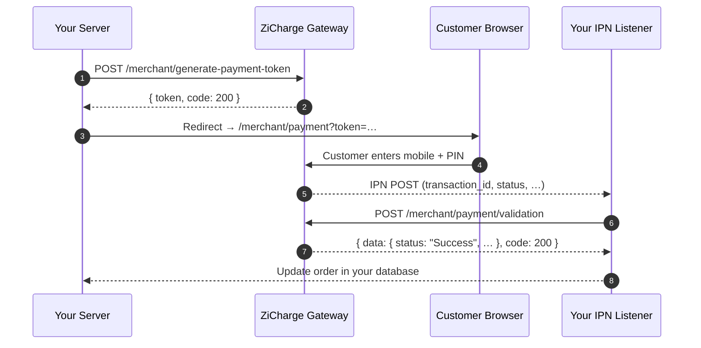

# API Reference

The ZiCharge integration follows a three-step flow. Each step maps directly to one of the sections below.

<div class="zi-info-row" markdown>

<div class="zi-info-box" markdown>
**Sandbox**

`https://dev.zicharge.com`

Test environment — no real funds move. Separate store credentials required.
</div>

<div class="zi-info-box" markdown>
**Production**

`https://secure.zicharge.com`

Live transactions. TLS enforced. Use production store credentials.
</div>

<div class="zi-info-box" markdown>
**Method & format**

All API calls are `POST`. Parameters sent as form-encoded or JSON. Responses are JSON.
</div>

</div>

---

## Integration flow



---

<div class="zi-section-anchor" id="generate-payment-token">
<span class="zi-section-anchor__num">1</span>
<span class="zi-section-anchor__label">Generate Payment Token</span>
</div>

<div class="zi-endpoint-header">
<span class="zi-method zi-method--post">POST</span>
<div class="zi-endpoint-header__right">
<span class="zi-endpoint-header__path">/merchant/generate-payment-token</span>
<span class="zi-endpoint-header__desc">Create a payment session. Returns a <code>token</code> that you use to redirect the customer to the ZiCharge hosted payment page.</span>
<div class="zi-endpoint-header__meta">
<span class="zi-badge zi-badge--auth">Server-to-server</span>
</div>
</div>
</div>

=== "cURL"

    ```bash
    curl -X POST https://secure.zicharge.com/merchant/generate-payment-token \
      -d "merchant_mobile_no=+9641234567890" \
      -d "store_password=your-store-password" \
      -d "order_id=ORD-2026-000123" \
      -d "bill_amount=1000" \
      -d "success_url=https://your-domain.com/success" \
      -d "fail_url=https://your-domain.com/fail" \
      -d "cancel_url=https://your-domain.com/cancel"
    ```

=== "Java"

    ```java
    import java.net.URI;
    import java.net.http.*;

    String form = "merchant_mobile_no=%2B9641234567890"
                + "&store_password=your-store-password"
                + "&order_id=ORD-2026-000123"
                + "&bill_amount=1000"
                + "&success_url=https%3A%2F%2Fyour-domain.com%2Fsuccess"
                + "&fail_url=https%3A%2F%2Fyour-domain.com%2Ffail"
                + "&cancel_url=https%3A%2F%2Fyour-domain.com%2Fcancel";

    HttpClient client = HttpClient.newHttpClient();
    HttpRequest request = HttpRequest.newBuilder()
        .uri(URI.create("https://secure.zicharge.com/merchant/generate-payment-token"))
        .header("Content-Type", "application/x-www-form-urlencoded")
        .POST(HttpRequest.BodyPublishers.ofString(form))
        .build();

    HttpResponse<String> response = client.send(request, HttpResponse.BodyHandlers.ofString());
    // Parse response.body() as JSON — read "token" field
    ```

=== "PHP"

    ```php
    $post_data = [
        'merchant_mobile_no' => '+9641234567890',
        'store_password'     => 'your-store-password',
        'order_id'           => 'ORD-2026-000123',
        'bill_amount'        => '1000',
        'success_url'        => 'https://your-domain.com/success',
        'fail_url'           => 'https://your-domain.com/fail',
        'cancel_url'         => 'https://your-domain.com/cancel',
    ];

    $handle = curl_init();
    curl_setopt($handle, CURLOPT_URL, 'https://secure.zicharge.com/merchant/generate-payment-token');
    curl_setopt($handle, CURLOPT_TIMEOUT, 10);
    curl_setopt($handle, CURLOPT_POST, 1);
    curl_setopt($handle, CURLOPT_POSTFIELDS, $post_data);
    curl_setopt($handle, CURLOPT_RETURNTRANSFER, true);

    $content  = curl_exec($handle);
    curl_close($handle);

    $response = json_decode($content, true);
    $token    = $response['token'];
    ```

=== "JavaScript"

    ```javascript
    const params = new URLSearchParams({
        merchant_mobile_no: '+9641234567890',
        store_password:     'your-store-password',
        order_id:           'ORD-2026-000123',
        bill_amount:        '1000',
        success_url:        'https://your-domain.com/success',
        fail_url:           'https://your-domain.com/fail',
        cancel_url:         'https://your-domain.com/cancel',
    });

    const res  = await fetch(
        'https://secure.zicharge.com/merchant/generate-payment-token',
        { method: 'POST', body: params }
    );
    const data  = await res.json();
    const token = data.token;
    // Redirect customer to: /merchant/payment?token=<token>
    ```

=== "Parameters"

    | Parameter | Required | Description |
    |-----------|:--------:|-------------|
    | `merchant_mobile_no` | Preserved | Your ZiCharge merchant mobile number |
    | `store_password` | Preserved | Your store password from the ZiCharge merchant dashboard |
    | `order_id` | Preserved | Unique identifier for this order — generated by your system |
    | `bill_amount` | Preserved | Payment amount in IQD |
    | `success_url` | Preserved | Your page to redirect to after successful payment |
    | `fail_url` | Preserved | Your page to redirect to after failed payment |
    | `cancel_url` | Preserved | Your page to redirect to if customer cancels |

=== "Response"

    ```json
    {
      "messages": "",
      "token":    "giu47z87fyr863adsfajfdenbof1846as4fd68a1v8e8a6e1fa8df48e88ef49a8sd7f458ve4s4dfgpkk",
      "code":     "200"
    }
    ```

    | Field | Description |
    |-------|-------------|
    | `token` | The payment session token — use this to redirect the customer |
    | `code` | `"200"` on success. Any other value means the request failed. |
    | `messages` | Error detail if `code` is not `"200"` |

=== "Errors"

    | Condition | What to do |
    |-----------|-----------|
    | `code` is not `"200"` | Read `messages` for the reason — fix the request before retrying |
    | Network / connection error | Retry with a fresh request |
    | Credential mismatch | Verify `merchant_mobile_no` and `store_password` in your merchant dashboard |

!!! danger "Keep `store_password` server-side only"
    Never embed `store_password` in a mobile app, browser JavaScript, or any URL. This call must only be made from your backend server.

---

## Redirect the customer

After receiving the token, redirect your customer's browser to the ZiCharge hosted payment page:

```
https://secure.zicharge.com/merchant/payment?token=<token>
```

The customer will enter their ZiCharge mobile number and PIN directly on the ZiCharge page. Your server is not involved at this step — ZiCharge handles the payment UI entirely.

!!! info "Sandbox redirect URL"
    During testing use `https://dev.zicharge.com/merchant/payment?token=<token>` with your sandbox store credentials.

---

<div class="zi-section-anchor" id="ipn-notification">
<span class="zi-section-anchor__num">2</span>
<span class="zi-section-anchor__label">Receive the IPN Notification</span>
</div>

When the customer completes or cancels payment, ZiCharge sends an HTTP `POST` to your **IPN URL** — configured in the ZiCharge merchant dashboard.

!!! warning "Configure your IPN URL before going live"
    Without an IPN URL set in the dashboard, you will not receive payment notifications. The IPN listener must be publicly reachable on port 80, 443, or 8080.

=== "IPN fields"

    | Field | Description |
    |-------|-------------|
    | `transaction_id` | Unique transaction ID assigned by ZiCharge |
    | `order_id` | The order ID you submitted when generating the token |
    | `bill_amount` | The amount from your original request — validate this matches |
    | `customer_account_no` | The ZiCharge wallet number that made the payment |
    | `status` | `Success`, `Failed`, or `Cancelled` |
    | `received_at` | Payment completion timestamp — format: `2026-05-14 12:55:45` |

=== "PHP example"

    ```php
    // Grab the POST notification
    $transaction_id      = $_POST['transaction_id'];
    $order_id            = $_POST['order_id'];
    $bill_amount         = $_POST['bill_amount'];
    $customer_account_no = $_POST['customer_account_no'];
    $status              = $_POST['status'];
    $received_at         = $_POST['received_at'];

    // Validate: check order exists in your DB
    //           and amount matches what you originally sent
    // Then call the Validation API (see below)
    ```

=== "Security checks"

    Before acting on an IPN, verify all three of the following:

    - [ ] `order_id` exists in your database
    - [ ] `bill_amount` matches the amount you originally sent to ZiCharge
    - [ ] `transaction_id` has not already been processed (prevent duplicate handling)

    Only after all three pass should you call the Validation API and update your order.

---

<div class="zi-section-anchor" id="validate-payment">
<span class="zi-section-anchor__num">3</span>
<span class="zi-section-anchor__label">Validate Payment</span>
</div>

<div class="zi-endpoint-header">
<span class="zi-method zi-method--post">POST</span>
<div class="zi-endpoint-header__right">
<span class="zi-endpoint-header__path">/merchant/payment/validation</span>
<span class="zi-endpoint-header__desc">Confirm the transaction details server-side after receiving an IPN. Call this before updating your order status — do not trust the IPN payload alone.</span>
<div class="zi-endpoint-header__meta">
<span class="zi-badge zi-badge--auth">Server-to-server</span>
</div>
</div>
</div>

=== "cURL"

    ```bash
    curl -X POST https://secure.zicharge.com/merchant/payment/validation \
      -d "merchant_mobile_no=your_merchant_mobile_no" \
      -d "store_password=your_store_password" \
      -d "order_id=your_order_id"
    ```

=== "Java"

    ```java
    import java.net.URI;
    import java.net.http.*;

    String form = "merchant_mobile_no=your_merchant_mobile_no"
                + "&store_password=your_store_password"
                + "&order_id=your_order_id";

    HttpClient client = HttpClient.newHttpClient();
    HttpRequest request = HttpRequest.newBuilder()
        .uri(URI.create("https://secure.zicharge.com/merchant/payment/validation"))
        .header("Content-Type", "application/x-www-form-urlencoded")
        .POST(HttpRequest.BodyPublishers.ofString(form))
        .build();

    HttpResponse<String> response = client.send(request, HttpResponse.BodyHandlers.ofString());
    // Parse response.body() as JSON — read "data" and "code" fields
    ```

=== "PHP"

    ```php
    $post_data = [
        'merchant_mobile_no' => 'your_merchant_mobile_no',
        'store_password'     => 'your_store_password',
        'order_id'           => 'your_order_id', // from the IPN
    ];

    $handle = curl_init();
    curl_setopt($handle, CURLOPT_URL, 'https://secure.zicharge.com/merchant/payment/validation');
    curl_setopt($handle, CURLOPT_TIMEOUT, 10);
    curl_setopt($handle, CURLOPT_POST, 1);
    curl_setopt($handle, CURLOPT_POSTFIELDS, $post_data);
    curl_setopt($handle, CURLOPT_RETURNTRANSFER, true);

    $result = curl_exec($handle);
    curl_close($handle);

    $result = json_decode($result);
    $data   = $result->data;
    $code   = $result->code;
    ```

=== "JavaScript"

    ```javascript
    const params = new URLSearchParams({
        merchant_mobile_no: 'your_merchant_mobile_no',
        store_password:     'your_store_password',
        order_id:           'your_order_id', // from the IPN
    });

    const res    = await fetch(
        'https://secure.zicharge.com/merchant/payment/validation',
        { method: 'POST', body: params }
    );
    const result = await res.json();
    const { data, code } = result;
    ```

=== "Parameters"

    | Parameter | Required | Description |
    |-----------|:--------:|-------------|
    | `merchant_mobile_no` | Preserved | Your ZiCharge merchant mobile number |
    | `store_password` | Preserved | Your store password |
    | `order_id` | Preserved | The order ID received in the IPN |

=== "Response"

    ```json
    {
      "messages": "Please find your transaction details:",
      "data": {
        "transaction_id":      "123456",
        "order_id":            "ORD-2026-000123",
        "bill_amount":         "1000",
        "customer_account_no": "+9649876543210",
        "status":              "Success",
        "received_at":         "2026-05-14 12:55:45"
      },
      "code": "200"
    }
    ```

    | Field | Description |
    |-------|-------------|
    | `data.transaction_id` | Unique ZiCharge transaction reference — store this in your database |
    | `data.order_id` | Your order ID — confirm it matches your record |
    | `data.bill_amount` | The charged amount — **validate this matches your original order amount** |
    | `data.status` | `Success`, `Failed`, or `Cancelled` |
    | `data.received_at` | When the transaction was completed |

=== "Security checks"

    After receiving the validation response, verify before fulfilling the order:

    - [ ] `code` is `"200"` and no network errors occurred
    - [ ] `data.bill_amount` matches the amount in your database
    - [ ] `data.status` is `"Success"`
    - [ ] `data.transaction_id` has not been processed before

    Only after all four pass should you mark the order as paid and deliver the service.

!!! warning "Validate — never trust the IPN alone"
    The IPN is a notification trigger only. Always call the Validation API to confirm the transaction before fulfilling an order or updating your database.

---

## Update your transaction

Once the Validation API confirms `status: Success` and the amount matches, update your order in your database and display the appropriate page to the customer.

<div class="zi-env-grid" markdown>

<div class="zi-env-card zi-env-card--prod" markdown>
### Success

Update order status to **paid**. Deliver the product or service. Redirect the customer to your `success_url`.
</div>

<div class="zi-env-card zi-env-card--sandbox" markdown>
### Failed or Cancelled

Update order status to **failed** or **cancelled**. Do not deliver service. Redirect to `fail_url` or `cancel_url` accordingly.
</div>

</div>

---

## Common issues

<div class="zi-trust-grid" markdown>

<div class="zi-trust-card" markdown>
<div class="zi-trust-card__num">Note</div>

**IPN not received**

Your IPN listener must be publicly reachable from the internet on port 80, 443, or 8080. Whitelist ZiCharge IPs at your network firewall if you have IP filtering in place.
</div>

<div class="zi-trust-card" markdown>
<div class="zi-trust-card__num">Note</div>

**Amount mismatch**

Always validate `bill_amount` in the IPN and Validation API response against the amount stored in your database. Reject if they don't match.
</div>

<div class="zi-trust-card" markdown>
<div class="zi-trust-card__num">Note</div>

**Duplicate IPN**

ZiCharge may re-send an IPN if your listener doesn't respond in time. Always check `transaction_id` against your database before processing to prevent double-fulfillment.
</div>

</div>
