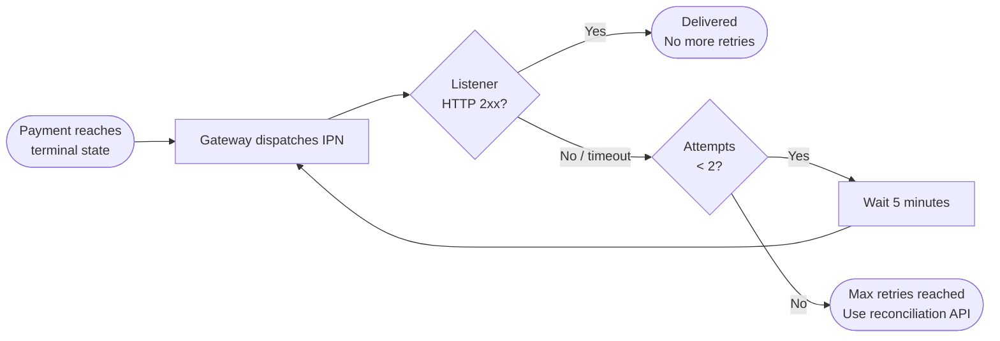

# IPN Callbacks

IPN (Instant Payment Notification) is how ZiCharge tells your platform when a payment reaches a terminal state. It is **at-least-once**, **signed**, and **automatically retried** — your only obligation is to acknowledge after you persist.

<div class="zi-info-row" markdown>
<div class="zi-info-box" markdown>
**Delivery**

At-least-once. Build your listener to be idempotent on `X-ZiCharge-Request-Id`.
</div>
<div class="zi-info-box" markdown>
**Retries**

Up to 2 attempts per terminal event. If the first delivery fails, a retry is sent after 5 minutes.
</div>
<div class="zi-info-box" markdown>
**Signature**

HMAC-SHA256 over the raw body. Enable on your dashboard for authenticity proof.
</div>
</div>

---

## Payload contract

The gateway POSTs to the `ipn_url` configured on your merchant account.

- **Method:** `POST`
- **Content-Type:** `application/x-www-form-urlencoded`
- **Encoding:** UTF-8

### Body fields

| Field | Type | On `Success` | On `Cancelled` |
|-------|------|-------------|----------------|
| `transaction_id` | string | Numeric ledger transaction ID | `""` empty string |
| `order_id` | string | Your original `order_id` | Same |
| `bill_amount` | string | e.g. `"5000"` | Same |
| `customer_account_no` | string | Customer mobile `"+9647701234567"` | Customer mobile if known, else `""` |
| `status` | string | `"Success"` | `"Cancelled"` |
| `received_at` | string | `"yyyy-MM-dd HH:mm:ss"` UTC | Same |
| `ipn` | string | `"1"` | `"1"` |

### Signature headers

Included when payload signatures are enabled on your merchant config:

| Header | Description |
|--------|-------------|
| `X-ZiCharge-Signature` | Hex HMAC-SHA256 of the **raw** form body |
| `X-ZiCharge-Timestamp` | Unix epoch seconds at dispatch time |
| `X-ZiCharge-Request-Id` | Opaque ID — use for deduplication and support correlation |

---

## Listener implementation

=== "Java"

    ```java
    // Java (Spring Boot)
    @PostMapping("/webhooks/zicharge/ipn")
    public ResponseEntity<Void> handleIpn(
            HttpServletRequest request,
            @RequestHeader("X-ZiCharge-Signature")  String signature,
            @RequestHeader("X-ZiCharge-Timestamp")  String timestamp,
            @RequestHeader("X-ZiCharge-Request-Id") String requestId) throws Exception {

        byte[] rawBody = request.getInputStream().readAllBytes(); // raw bytes — not parsed

        // 1. Signature check
        Mac mac = Mac.getInstance("HmacSHA256");
        mac.init(new SecretKeySpec(IPN_SECRET.getBytes("UTF-8"), "HmacSHA256"));
        StringBuilder sb = new StringBuilder();
        for (byte b : mac.doFinal(rawBody)) sb.append(String.format("%02x", b));
        if (!MessageDigest.isEqual(sb.toString().getBytes(), signature.getBytes())) {
            return ResponseEntity.badRequest().build();
        }

        // 2. Timestamp drift — reject requests older than 5 minutes
        long ts = Long.parseLong(timestamp);
        if (Math.abs(System.currentTimeMillis() / 1000L - ts) > 300) {
            return ResponseEntity.badRequest().build();
        }

        // 3. Idempotency — deduplicate by request ID
        if (ipnLogRepository.exists(requestId)) {
            return ResponseEntity.ok().build(); // already stored — safe to acknowledge
        }

        // 4. Parse, validate, persist
        Map<String, String> fields = parseFormBody(new String(rawBody, "UTF-8"));
        ipnLogRepository.save(fields, requestId);

        // 5. Acknowledge ONLY after persistence
        return ResponseEntity.ok().build();
    }
    ```

=== "PHP"

    ```php
    function handleIpn(Request $request): Response {
        $body = $request->getRawBody(); // raw bytes — not parsed

        // 1. Signature check
        $expected = hash_hmac('sha256', $body, IPN_SECRET);
        if (!hash_equals($expected, $request->header('X-ZiCharge-Signature'))) {
            return new Response(400);
        }

        // 2. Timestamp drift — reject requests older than 5 minutes
        $ts = (int) $request->header('X-ZiCharge-Timestamp');
        if (abs(time() - $ts) > 300) {
            return new Response(400);
        }

        // 3. Idempotency — deduplicate by request ID
        $requestId = $request->header('X-ZiCharge-Request-Id');
        if (IpnLog::exists($requestId)) {
            return new Response(200); // already stored — safe to acknowledge
        }

        // 4. Persist
        parse_str($body, $fields);
        IpnLog::store($fields, $requestId);

        // 5. Acknowledge ONLY after persistence
        return new Response(200);
    }
    ```

=== "JavaScript"

    ```javascript
    const crypto = require('crypto');

    async function handleIpn(req, res) {
        const body = req.rawBody; // raw buffer — not parsed

        // 1. Signature check (timingSafeEqual prevents timing attacks)
        const expected = crypto.createHmac('sha256', IPN_SECRET)
            .update(body).digest('hex');
        const received = Buffer.from(req.headers['x-zicharge-signature'] || '', 'utf8');
        if (!crypto.timingSafeEqual(Buffer.from(expected, 'utf8'), received)) {
            return res.status(400).end();
        }

        // 2. Timestamp drift — reject requests older than 5 minutes
        const ts = parseInt(req.headers['x-zicharge-timestamp'], 10);
        if (Math.abs(Date.now() / 1000 - ts) > 300) {
            return res.status(400).end();
        }

        // 3. Idempotency — deduplicate by request ID
        const requestId = req.headers['x-zicharge-request-id'];
        if (await isProcessed(requestId)) {
            return res.status(200).end(); // already stored — safe to acknowledge
        }

        // 4. Parse & persist
        const fields = new URLSearchParams(body.toString());
        await persistIpn(Object.fromEntries(fields), requestId);

        // 5. Acknowledge ONLY after persistence
        res.status(200).end();
    }
    ```

!!! warning "Always verify the raw body bytes"
    Compute the HMAC against **raw request bytes** — before any parsing. Re-encoding parsed form fields changes byte order and will break the signature match.

!!! danger "Acknowledge only after you persist"
    Return **2xx only after** you have written the IPN to your database. A 2xx permanently stops retries. Return **5xx** if your database is unavailable — we will retry.

---

## Delivery semantics



| Guarantee | Detail |
|-----------|--------|
| **At-least-once** | Deduplicate on `X-ZiCharge-Request-Id` or on `(order_id, status)` |
| **No Success after Cancelled** | Token state machine guarantees one terminal outcome per token |
| **5-minute retry gap** | If the first attempt fails, one retry is sent after 5 minutes |
| **Max 2 attempts** | After exhaustion, recover with `fetch-payment-status` |

---

## HTTP response guide

| Your response | What happens |
|---------------|-------------|
| **2xx** | Delivered. Retries permanently stopped. |
| 3xx | Not followed. Treated as failure. Retry scheduled. |
| 4xx | Failure. Retry scheduled. Avoid 4xx unless you want retries. |
| **5xx** | Failure. Retry scheduled. Use this when your DB is down. |
| Timeout > 10 s | Failure. Retry scheduled. |

---

## Configuring your IPN URL

Set `ipn_url` from the merchant dashboard:

<div class="zi-trust-grid" markdown>

<div class="zi-trust-card" markdown>
<div class="zi-trust-card__num">—</div>

**HTTPS only**

Plain HTTP `ipn_url` values are rejected at configuration time.
</div>

<div class="zi-trust-card" markdown>
<div class="zi-trust-card__num">—</div>

**Dedicated path**

Use a specific route like `/webhooks/zicharge/ipn` behind your ingress — not a generic handler.
</div>

<div class="zi-trust-card" markdown>
<div class="zi-trust-card__num">—</div>

**Public DNS**

URLs resolving to RFC 1918, loopback, or link-local addresses are blocked (SSRF hardening on the gateway side).
</div>

</div>

!!! tip "Zero-downtime secret rotation"
    The gateway accepts **two active `ipn_secret` values** simultaneously. Provision the new secret, deploy your listener to accept both, then retire the old one — no IPNs are dropped during rotation.

---

## Synchronous fallback

If your listener was down longer than the retry window, recover with the reconciliation endpoints:

```bash
# Fast yes/no — use when you know order_id and amount
POST /merchant/fetch-payment-status
{ "merchant_mobile_no": "...", "order_id": "ORD-...", "amount": 5000 }

# Full detail — use when you need transaction_id and timestamp
POST /merchant/validate-payment
{ "merchant_mobile_no": "...", "store_password": "...", "order_id": "ORD-..." }
```

Both are read-only and safe to call repeatedly.

---

## Observability

Every IPN dispatch emits a structured log entry tagged with `X-ZiCharge-Request-Id`. If a delivery is in dispute, provide that ID to support — we can show you exact dispatch attempts, HTTP response codes, retry timings, and (if signatures enabled) the bytes signed.
